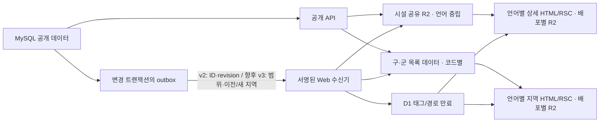

# 공개 지도·다국어 캐시 재설계안

2026-09-22 · 설계 초안 · 이 문서 자체는 캐시 설정이나 운영 데이터를 변경하지 않는다.

## 판단 기준

시설 원본은 MySQL/API가 진실의 원천이다. 캐시는 공개 응답만 저장한다. 같은 시설의 여러 언어를 별도 원본 객체로 복제하지 않고, 언어별 HTML·메타데이터는 별도 경로로 렌더링한다. 지역 지도는 행정구역 **코드**로 묶고, 화면에서 움직이는 지도의 임의 좌표 범위는 지역 페이지 캐시와 구분한다.

기존 OpenNext R2 증분 캐시, D1 태그 저장소, 공유 시설 R2, API의 MySQL outbox와 서명된 수신기를 그대로 기반으로 쓴다. Cloudflare CDN에 HTML/JSON 전체 캐시 규칙을 추가하지 않는다. 현재 HTML/RSC는 외부 브라우저·CDN에 `no-store`로 제공하고 OpenNext 내부 ISR만 사용한다.

## 현재 상태와 공백

| 대상 | 현재 구현 | 보강할 점 |
| --- | --- | --- |
| 시설 상세 원본 | `public-toilets/v1/toilets/{id}.json` 공유 R2. 30일 fresh, 원본 장애 시 저장 후 37일까지 stale, 404는 5분. 공개 번역을 한 객체에 담는다. | 공개 상세 응답의 `normalizedOpeningHours`가 공유 객체 화이트리스트에서 빠져 있다. 필드 추가와 스키마 세대 전환을 검토한다. |
| 시설 상세 HTML/RSC | 배포별 OpenNext R2, `/toilet/{id}`와 지역 시설 경로는 30일 ISR. 한국어·영어·일본어·중국어 지역별 URL은 서로 다른 페이지다. | 현 수신기는 언어별 `/toilet/{id}`만 명시적으로 무효화한다. `/regions/{sido}/{sigungu}/toilet/{id}-{slug}`의 이전·새 경로도 처리해야 한다. |
| 지역별 지도 | 구·군 페이지 및 API의 경계 사각형 조회가 각각 1시간 재검증. 서버가 다각형으로 거른 목록을 지도에 제공한다. | 조회에 지역 태그가 없고 수신기도 지역 페이지를 무효화하지 않는다. 그룹명·시설 번역·좌표 변경은 최장 1시간 늦게 보일 수 있다. API 오류를 잡아 빈 지도 화면을 렌더링하므로 이 실패 결과가 페이지 캐시에 남지 않게 해야 한다. |
| 지역별 시설 수·지명 | `data/regions/counts.json`, `names.json`, 경계 JSON이 웹 빌드에 포함된다. | 이벤트로 태그를 지워도 빌드 속 JSON은 바뀌지 않는다. 시설 수는 갱신 가능한 집계로 분리하고, 경계·검수된 지명은 버전이 있는 배포 자산으로 유지한다. |
| 전국/일반 지도 | 브라우저가 `/api/v1/toilets`를 직접 조회한다. 상세 카드만 탭 안에서 30초, 최대 30건 재사용한다. | 임의 bounds 전체를 R2/CDN 키로 만들지 않는다. 반복 요청 최적화가 필요하면 탭 안의 짧고 제한된 캐시만 별도 검토한다. |
| 사이트맵 | SEO PR #194/#287에서 공개 ID뿐 아니라 언어별 최신 이름·주소 자격과 이름·좌표로 정식 URL을 만든다. 원본은 `toilet-catalog` 태그로 1시간, XML은 공유 캐시 5분. | 이름·좌표·주소·번역 변경도 사이트맵에 영향을 주므로 `catalog_changed`는 공개 ID 집합만 뜻하지 않는다. API PR #195가 원본 필드 변경을 추가로 포착한다. |
| 리뷰·사진·계정 | 리뷰 목록은 브라우저 30초, 목록 평점은 1분. 공개 프로필 사진은 별도 CDN 정책. 로그인·관리자 읽기는 캐시하지 않는다. | 시설 캐시와 섞지 않는다. 리뷰·사진 변경은 각자의 무효화 경로를 유지한다. |

API v2 이벤트는 시설 ID·revision·action·`catalogChanged`만 전달한다. DB의 `toilet_translation`과 `toilet_opening_hours` 트리거는 이벤트를 보내지만, 운영 현행에는 display-group 번역·멤버 변경이 빠져 있고 변경 **전** 지역 코드도 전달되지 않는다. API PR #195는 그룹 변경을 기존 ID outbox에 넣고, Web PR #289는 모든 시설 이벤트에 공통 지역 태그와 언어별 지역 경로를 만료한다. 따라서 이전 지역 코드 없이도 오래된 지도가 남지 않지만, 편집이 잦으면 모든 지역 데이터가 자주 재생성되는 비용이 있다. outbox 전달 지연·실패가 생기면 30일 캐시가 오래된 화면을 지속할 수 있으므로, TTL 확대 전에 전달 상태를 검증해야 한다. 공유 캐시 플래그를 끄는 것만으로 현재 30일 Next fetch/페이지 TTL이 1시간으로 바뀌지는 않는다.

## 목표 캐시 계층

| 계층 / 키 | 담을 정보 | 제안 유효기간과 갱신 |
| --- | --- | --- |
| 공유 시설 `toilet:{id}` | 한국어 원본, 사용 가능한 모든 언어의 시설명·주소, 검증된 지역, 개방시간 등 공개 상세 계약. 방문자·인증 정보 제외 | 현재 30일/장애 시 37일/404 5분을 유지하되, 정상적인 outbox 전달과 긴급 단축 경로를 검증한 뒤에만 장기 TTL 운영. ID revision과 R2 ETag로 역순 변경 방지. |
| 상세 페이지 `page:{build}:{locale}:{id}` | 언어별 HTML/RSC, title·description·구조화 데이터 | 현재 30일 ISR 유지. `toilet:{id}` 태그와 해당 언어별 일반/지역 시설 경로를 함께 만료. 요청 때 재생성. |
| 구·군 목록 `region-markers:{sigunguCode}` | 해당 다각형 안의 시설 ID·좌표·그룹·모든 공개 번역이 들어간 서버 지도 응답 | PR #289에서 Next 데이터 캐시를 **30일**로 확대하고 공통 `region-markers` 및 구·군별 태그를 붙인다. 기존 v2 이벤트에는 이전 지역이 없으므로 우선 모든 지역을 만료한다. 이후 범위 이벤트를 만들면 이전·새 구·군만 선택적으로 만료한다. 언어별로 원본 응답을 중복 저장하지 않음. |
| 지역 페이지 `page:{build}:{locale}:region:{code}` | 지도와 언어별 제목·문구·메타데이터 | PR #289는 ISR을 **30일**로 확대하고 이벤트마다 한국어·다국어 지역 라우트 전체를 만료한다. 정적 시설 수를 갱신 가능한 집계로 옮기고 v3 범위 이벤트를 도입한 뒤 영향받은 구·군 경로만 만료한다. |
| 지역 수 `region-counts:{code}` | 공개 시설 수, 상위 시·도/전국 합계, 집계 시각 | 빌드 JSON 대신 공개 집계 API 또는 갱신 가능한 스냅샷. 변경 이벤트 완성 전에는 1시간, 이후에는 지역 페이지와 같은 30일 TTL + 즉시 만료. 코드·수치만 저장하고 언어별 숫자 형식은 렌더링 시 적용. |
| 지명·경계 자산 | 공식 코드, 다각형, 검수한 언어별 지명 | 현재처럼 빌드에 포함하고 자산 버전으로 관리. 번역 정정·경계 교체는 생성기 검증 후 웹 배포가 필요하며 런타임 태그 무효화로 해결할 수 없음. |
| 사이트맵 `toilet-catalog` | 공개 시설 ID, 언어별 자격·현재 이름·좌표 및 shard | 공개 ID·가시성, 이름·좌표·원본 주소, 번역 변경 때 만료. 1시간 원본 + XML 5분 유지. 그룹명·멤버 변경은 사이트맵과 무관. |
| 브라우저 지도/카드 | 현재 뷰포트 응답과 선택한 공개 상세 | 기본은 직접 API 조회. 필요 시 동일 정규화 bounds·zoom·필터에 한해 탭 메모리 15~30초·최대 20개로 제한하고 지도 이동/필터 전환 시 이전 결과를 표시하지 않음. |

언어 코드는 `ko`, `en`, `ja`, `zh-cn`, `zh-tw`, `zh-hk`로 정규화한다. 공유 시설·지역 마커 **데이터**는 언어 중립이며, 페이지와 메타데이터는 언어별이다. 특정 번역이 빠졌을 때의 한국어 대체 표시와 중국어 지역 간 임의 혼용 금지는 현 규칙을 유지한다. 번역 변경은 해당 언어의 사이트맵 자격과 URL을 바꿀 수 있으므로 `toilet-catalog`도 만료한다. 일반 전국 지도는 직접 API를 조회한다.

지역 데이터 재생성에 실패하면 빈 목록을 정상 응답처럼 저장하지 않는다. 기존 ISR 페이지가 있으면 그 페이지를 유지하고 재시도하며, 첫 방문이라 저장된 페이지가 없으면 오류 화면을 반환한다. 실제 시설 0건은 API가 정상 응답했을 때만 캐시한다.

### 30일 캐시와 모바일 로딩

지역 정보가 드물게 바뀐다는 점에는 동의한다. 현행 1시간은 지역 지도 기능을 추가할 때 지정한 값이며, 별도의 근거 문서는 확인하지 못했다. 현행에는 지역 무효화가 없어서 1시간이 변경 반영의 안전망이다. API PR #195의 그룹 이벤트 SQL 설치·outbox 전달 확인과 Web PR #289의 공통 태그 무효화가 함께 끝난 뒤 마커 데이터와 언어별 지역 페이지를 30일로 늘린다. 상세 시설과 마찬가지로 변경 시 즉시 태그·경로를 만료하고, 알림 장애 때 짧은 TTL로 되돌릴 수 있어야 한다.

30일은 **재생성 빈도**를 낮추는 설정이지 첫 방문이나 모바일 지도 실행 시간을 직접 줄이는 설정은 아니다. 실제 유성구 `/regions/30/30200` 반복 요청에서 서버 캐시 `HIT`가 확인됐고, 원격 점검 기준 첫 바이트까지 약 0.8초였다. 이는 모바일 화면의 지도 표시 시간 측정값이 아니다. 현재 브라우저는 페이지 수신 뒤 지도 제공자 설정을 `no-store`로 다시 요청하고, 네이버 지도 SDK를 로드한 다음 시설 번역·좌표 그룹화·클러스터·마커를 그린다. 모바일 개선은 네트워크 워터폴과 지도 표시 시각을 측정한 뒤, 설정 요청 단축, 선택 언어만 담은 클라이언트 데이터, 초기 표시 마커 수·경계 그리기 비용을 우선 점검한다.

## 변경별 무효화

| 변경 | 공유 상세/상세 페이지 | 구·군 지도/시설 수 | 사이트맵 및 별도 캐시 |
| --- | --- | --- | --- |
| 시설 이름·주소·유형·설비 | 현재는 해당 ID와 언어별 일반 상세 경로만 만료. 지역 상세의 이전/새 slug는 후속 처리 | 첫 구현은 공통 지역 태그와 지역 라우트 전체 만료. 이후 해당 구·군으로 좁힌다 | 이름·원본 주소 변경이면 언어별 sitemap 자격/URL 재계산 |
| 좌표 이동·지역 판정 변경 | 해당 ID와 언어별 일반 상세 경로. 이전/새 지역 시설 경로는 후속 처리 | 첫 구현은 공통 지역 태그와 지역 라우트 전체 만료. 경계 출입에 따른 실시간 시설 수는 별도 집계 작업 | 좌표 변경이면 canonical 지역과 sitemap URL 재계산 |
| 시설 번역 추가·수정·삭제 | 해당 ID의 공유 객체와 언어별 일반 상세 페이지. 지역 상세 slug·canonical 경로는 후속 처리 | 공통 지역 태그와 지역 라우트 전체 만료 | 해당 언어의 자격/URL과 hreflang 재계산 |
| 그룹 이름·번역·멤버·좌표 변경 | 현재 상세에 그룹명이 없지만 기존 ID outbox가 공유 객체도 만료 | PR #195가 영향 멤버 ID를 기록하고 #289가 공통 지역 태그와 지역 라우트 전체를 만료. 전국 일반 지도는 다음 직접 조회에서 반영 | 그룹 변경은 사이트맵과 무관 |
| 개방시간·24시간 여부 | 해당 ID 상세와 언어별 일반 페이지 | 현재 구·군 지도 응답에는 개방시간 필드가 없지만 v2 공통 무효화는 실행된다. v3에서 이 유형을 제외해 불필요한 재생성을 줄인다 | 현재 V5 이벤트는 `catalogChanged`도 보내므로 사이트맵을 무효화한다. v3에서 사이트맵 입력 변경과 분리한다 |
| 공개 시설 추가·삭제·비공개/복구 | 해당 ID의 음수 캐시/tombstone과 일반 상세 경로 | 첫 구현은 모든 구·군 목록을 만료. 시설 수는 정적 JSON이므로 별도 집계 전환 필요 | 공개 ID가 바뀌므로 사이트맵 만료 |
| 지역 지명 번역·경계 자료 | 시설 상세의 DB 지역 표시가 바뀌면 해당 상세 처리 | `names.json`·경계 JSON 생성 및 웹 배포. 경계 변화는 영향 지역 목록·시설 수를 재계산 | 새 빌드의 메타데이터/사이트맵 검증 |
| 리뷰·평점·프로필 사진 | 시설 공유 데이터에 넣지 않음 | 지역 지도 데이터와 무관 | 브라우저 리뷰 캐시·사진 CDN의 기존 정책만 적용 |

SEO PR #287의 지역 시설 URL은 **해당 언어의 현재 이름으로 만든 slug**와 좌표의 지역 코드에 의존한다. 따라서 번역·이름·좌표가 바뀌면 이전 URL도 만료해 새 URL로의 리다이렉트/404가 오래된 HTML에 가려지지 않도록 해야 한다. 현재 수신기는 일반 `/toilet/{id}` 별칭만 명시적으로 만료하므로, 지역 시설 경로의 이전·새 slug 추적은 후속 구현 항목이다. 30일 **지역 지도** 캐시는 이 경로 문제와 구분해 공통 태그로 안전하게 만료한다.

## 이벤트와 일관성 계약

v2 수신기를 유지하며 첫 단계에서는 모든 시설 이벤트로 공통 지역 태그를 만료한다. `catalogChanged`는 신규·삭제·공개 여부 외에 **현재 이름·좌표·주소와 번역** 등 사이트맵 입력 변경에도 쓴다. 그룹 변경은 PR #195가 멤버 ID별 이벤트를 기록하며 그룹 삭제 전에 멤버를 포착한다. 이후 v3에서 `entity`, `scopes`, 이전·새 `affectedDistrictCodes`, `revision`을 더해 영향 지역만 만료하는 계약으로 좁힌다. 이 최적화는 30일 보관의 정확성과 별개로 캐시 HIT와 API 비용을 개선하기 위한 단계다.

지역 이동 이벤트에는 변경 전·후 지역 코드를 모두 기록해야 한다. 마지막 상태만 조회하거나 한 시설의 outbox 행을 덮어쓰면 이전 지역 만료를 잃을 수 있으므로, 미전달 이벤트를 합칠 때 영향 지역의 **합집합**을 보존한다. 지역 코드는 화면의 다각형 판정과 같은 기준으로 계산·검증한다. API 쓰기, 관리자 수정, 배치 SQL 어느 경로에서도 트랜잭션 커밋 뒤 동일한 결과가 나와야 한다.

Web은 공유 객체 invalidation, D1 태그, 관련 경로 만료를 기록한 뒤 정확한 revision ACK를 돌려준다. 부분 실패는 503으로 재시도하고 중복·역순 이벤트는 revision으로 무시한다. 지역 집계와 마커의 재생성은 요청 시 수행해 변경 1건마다 6개 언어 페이지를 즉시 다시 만들지 않는다. 대량 번역 배치에는 5만 건 이상을 한꺼번에 webhook으로 쏟기 전에 새 데이터 세대 전환·분할 전송·속도 제한·선택적 사전 생성을 별도 절차로 둔다.

## 배포 순서와 완료 기준

1. 운영 outbox의 pending·최고 대기 시간·실패 코드와 수신기 응답을 읽기 전용으로 확인하고, 실제 수정 1건의 전달·반영을 추적한다. 이 경로가 불안정하면 30일 TTL 확대를 먼저 하지 않는다. 긴급 시 **공유 캐시와 Next 데이터/페이지를 함께** 짧은 TTL로 돌리는 검증된 설정·배포 경로를 준비한다.
2. SEO API #194와 웹 #287을 먼저 적용한다. API #195의 V6 수동 SQL을 설치·검증하고 그룹 이름·번역·멤버 변경의 outbox 이벤트를 확인한다. 그 뒤 웹 #289를 적용해 공통 지역 태그 및 언어별 지역 경로 무효화와 30일 TTL을 함께 켠다. 좌표 이동은 이전·새 지역을 모두 재조회하게 해야 한다.
3. `normalizedOpeningHours` 공개 계약을 공유 객체 화이트리스트에 추가한다. v1 객체와 호환 여부를 검사하고 필요하면 `public-toilets/v2/`로 세대를 올린다. 저장·삭제·비공개·복구 경쟁 테스트를 다시 통과시킨다.
4. 정적 시설 수를 갱신 가능한 코드별 집계로 옮긴다. 지명과 경계는 생성 결과·코드 일치 검사 후 버전이 있는 웹 배포로 반영한다.
5. 프리뷰에서 한 구·군의 한국어/영어/일본어/중국어 세 지역 페이지를 순회해 이름·그룹·주소 대체 표시를 확인한다. 시설의 구·군 이동은 이전 지도에서 제거되고 새 지도에 한 번만 나타나야 한다. 24시간·삭제·번역 수정·그룹 수정·slug 변경과 언어별 사이트맵 갱신도 확인한다.
6. 운영 적용은 수신기·API의 양방향 호환 배포 뒤 작은 표본으로 시작한다. 시설 상세 전체 사전 생성은 기존 한국어 대상만 유지하고, 여섯 언어 × 전체 시설을 일괄 생성하지 않는다. 지역 페이지는 방문량 높은 구·군과 언어를 우선 사전 생성한다.

운영 관측 목표는 outbox 최고 대기 시간 5분 초과 경고, 전달 실패율/재시도, 시설·지역 cache HIT 비율, API 원본 호출량, R2/D1 읽기·쓰기, 페이지 재생성 5xx를 함께 보는 것이다. 목표 숫자는 표본 부하 측정 뒤 확정한다. 캐시 HIT만 높고 변경 반영이 늦는 상태는 성공으로 보지 않는다.

## 구현 근거

- 현행 코드: `src/server/toilets.ts`, `src/server/sharedToiletCache.ts`, `src/server/regions.ts`, `src/components/regions/RegionPage.tsx`, `src/app/%5Finternal/cache/revalidate/route.ts`, `src/server/sitemaps.ts`, `src/lib/regions.ts`, `worker-cache-policy.mjs`, API의 `CacheInvalidation*` 및 V2~V5 수동 SQL.
- [Next.js `revalidateTag`](https://nextjs.org/docs/app/api-reference/functions/revalidateTag): 태그 만료는 해당 리소스의 다음 방문에서 갱신을 일으키며 동작 프로필에 따라 stale 표시 여부가 다르다.
- [OpenNext Cloudflare 캐싱](https://opennext.js.org/cloudflare/caching): 증분 캐시·재검증 큐·태그 저장소가 별도 계층이다.
- [Cloudflare 기본 캐시 동작](https://developers.cloudflare.com/cache/concepts/default-cache-behavior/): HTML/JSON을 기본 CDN 캐시로 간주하지 않는다.
