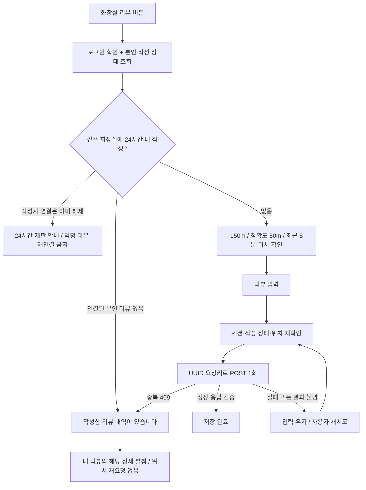

# 리뷰 API 연결 후보 — 개발 4주차(2026-09-07~09-13)

2026-09-12. 기존 디자인 프리뷰와 실제 서버 연결 코드를 구분한다. 운영 DB 변경·기능 활성화·회원 데이터 시험은 하지 않았다.

## 모드와 안전 경계

- 기본 프리뷰는 기존 메모리 모드. `SITE_INDEXABLE=false` + 빌드 환경의 `REVIEW_API_ENABLED=true`를 함께 지정했을 때만 API 모드를 선택한다.
- 공개 운영 빌드(`SITE_INDEXABLE=true`)에서는 두 리뷰 모드가 모두 꺼진다. 운영 활성화는 별도 변경/검증/승인 대상이다.
- URL·로컬 저장소·API 오류로 모드를 바꾸지 않는다. API 실패 시 메모리 저장 성공으로 대체하지 않는다.
- API 모드에서는 개인 테스트 좌표 fragment의 임시 시설을 만들지 않으며 0 이하 시설 ID를 API 전송 전에 거부한다.
- 현재 공개된 프리뷰·운영 Worker를 이 작업에서 배포하지 않았다. API는 별도 리뷰 구현 PR의 V12/엔드포인트를 필요로 한다.

## 작성과 기존 리뷰 이동

작성 중 동일 내용 재시도에는 같은 요청키를 유지한다. 저장 응답이 끊겼다면 다음 사전 조회에서 기존 리뷰로 이동하여 새 POST를 보내지 않는다. API 자체에서도 계정 행 잠금과 요청키/24시간 제한을 다시 적용한다. 자동 쓰기 재전송은 없다.

기기 좌표는 신규 작성용 POST 본문에서만 전송하며 URL·저장소·로그·리뷰 상태에 저장하지 않는다. 세션/GPS 사전 확인은 실제 방문 증명이나 위치 조작 방지 수단이 아니다. 약관·위치 목적 고지·자유글 보존 요청 처리 정책은 기존 후속 검토 대상이다.

## 내 리뷰

- 기본 최근 7일, 최근 30일/전체/직접 기간을 서버 쿼리에 전달. 한국 날짜의 시작/종료일을 사용한다.
- 최신순 10개씩 커서로 추가. 목록 끝에서 다음 페이지를 읽으며 중복 ID/동일 커서 반복/잘못된 응답은 거부한다.
- 기존 리뷰 링크는 본인 상세 API로 재검증한다. 첫 10건 밖의 대상도 별도로 가져와 펼친다.
- 수정은 최신 본인 상세와 버전을 다시 읽은 뒤 PATCH. 위치 재확인 없이 서버의 7일/소유권/버전 검사를 따른다.
- 휴지통 확인에서 API 성공 응답을 검증한 후 해당 항목만 제거한다. 실패 시 확인 화면·내용을 유지하고 오류를 표시한다. 본문/평가 보존, 해당 리뷰만 익명, 내 리뷰 제외 원칙은 유지한다.
- 로그아웃/계정 변경/화면 닫기/필터 변경 후 늦게 도착한 응답을 적용하지 않는다. 목록 조회는 공유 로그인 갱신 읽기 경로를 사용하며 쓰기는 자동 재시도하지 않는다.

## 검증 범위

- [x] 웹 단위 검사 157건, 타입/린트 검사.
- [x] API 모드 320/390/1280px 브라우저 검사: 비활성 실패 처리, 저장 전 네트워크 실패, 저장 후 응답 유실, 재시도 중복 방지, 새로고침 조회, 기존 리뷰 이동, 수정, 익명 처리 성공/실패, 날짜/커서, 계정 분리.
- [x] 위 브라우저 검사는 합성 HTTP 응답과 계정/GPS로 실행. 공개 시설 읽기만 허용했고 실제 리뷰/회원 쓰기는 모두 가로챘다. 실제 API↔DB 통합 인수 결과로 표기하지 않는다.
- [x] GitHub API 전체 회귀·Docker MySQL 및 웹 Workers/리뷰 API 모드 빌드 CI. API `d55052b` / 웹 `1f4ede5` 기준이며 이후 추가한 로컬 시험 실행기는 이 CI 결과에 포함하지 않는다.
- [x] 2026-09-12: loopback 실제 API + 새 MySQL 8.0.25 + Chrome 320/390/1280px 연결. 실제 작성/응답 유실/재조회/버전 수정/익명 처리/날짜·10개 커서/7일 기한/24시간 제한 및 동시 요청 경합 확인. `tests/review-real-api-browser.cjs` 사용.
- [x] 실제 리뷰 응답을 mock하지 않고 쿠키 JWT·DB 계정/약관 검사·리뷰 제품 코드를 실행. 세션 조회 응답/토큰 발급과 지도/GPS는 시험 구성이다. 브라우저 전송 계층의 Origin/CORS 정규화는 테스트에만 적용했다.
- [ ] 다른 브라우저 엔진/실기기, 실제 OAuth·세션 갱신·운영 쿠키/프록시 경로 인수. 위 로컬 통합 결과로 대체하지 않는다.
- [ ] 리뷰 단건 익명 전환 후 과거 백업의 작성자 연결 재등장 방지와 만료한 시설별 제한 메타데이터 정리.
- [ ] 정책 후속 검토, 별도 운영 DB 적용/배포/활성화 승인.

공개 WBS 항목은 이번 승인 범위에서 수정하지 않는다.

## 추가 준비: 한시적 실기기 검증

2026-09-12 임시 프리뷰 게시 승인을 받아 별도 CI 산출물을 준비한다. `review-api-validation.yml`만 시험 API 경로로 빌드하고 기존 디자인/운영 후보와 산출물 이름을 구별한다. 실제 배포 성공과 아이폰 인수는 별도 결과로 남긴다.

preview 전용 `/__review-verification` 경로는 운영 호스트/기본 설정/만료 후 차단한다. 허용된 시험 터널로만 전달하고 실제 Cookie·Authorization·Set-Cookie를 전달하지 않는다. 허용된 리뷰 API만 호출하며 요청은 8 KiB 이하, 쓰기는 동일 Origin JSON만 허용한다. 자동 redirect는 금지한다. 최대 2시간의 한시 설정은 로컬 배포 인자로만 지정하며 운영 Worker는 변경하지 않는다.

가상 사용자·시험 DB와 실제 리뷰 API를 연결하는 검증이다. 실제 Google/Kakao 로그인·토큰 갱신 검증이 아니다. 위치는 기기 GPS를 그대로 검사하고 리뷰 시설 좌표만 합성한다. 시험 DB 내용은 정리 대상이므로 개인정보나 실제 제보를 입력하지 않는다.

작성자 연결 보호가 실패하면 안전한 고정 안내를 띄우고 목록에서 성공한 것처럼 제거하지 않는다. 이 오류 대응과 preview 전달 경계 검사를 추가했으며, 운영 리뷰 모드는 아직 OFF다.
